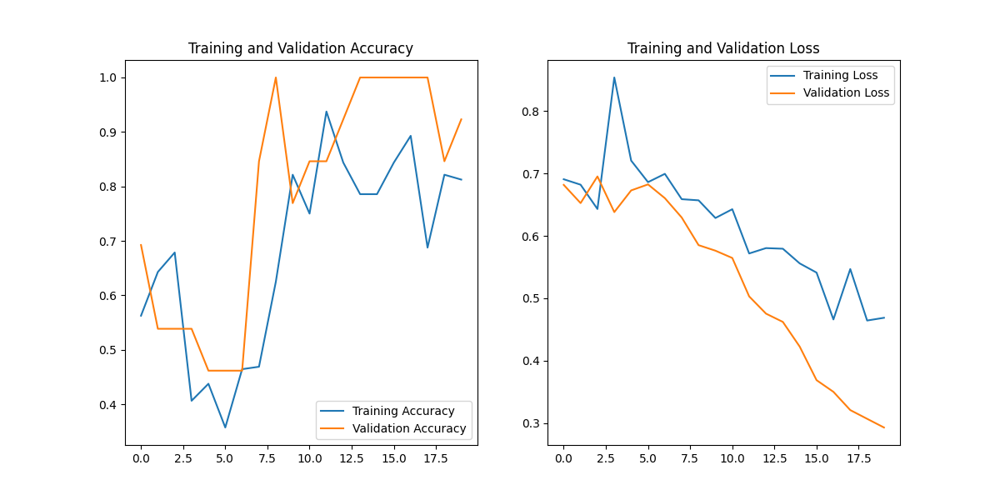
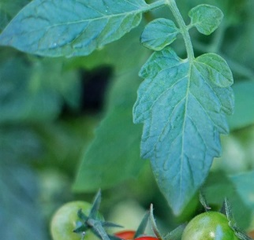

# Recess Python Programming

Welcome to my Recess Python Programming repository! This space documents my learning journey, assignments, and projects as I explore Python programming, Data Science, and Machine Learning.


---

## 📁 Project Structure

- **Python_Intro/**: Beginner Python assignments and exercises (lists, tuples, sets, strings, dictionaries, OOP concepts).
- **Data_Science/**: Data cleaning, analysis, and visualization assignments using real-world datasets.
- **Machine_learning/**: Machine learning scripts, datasets (crops, animals), and model training for crop disease detection and animal filtering.

## 🌱 Data Science Highlights
- Data cleaning, missing value handling, and exploratory analysis (see `Assignments/AssignmentFive.ipynb`).
- Example: Climate action dataset cleaning and analysis.

## 🤖 Machine Learning Highlights
- **Crop Disease Detection**: CNN model to classify crop images as healthy or diseased.
- **Animal Filtering**: Model to distinguish between animals (cat, dog, human) and crops.
- **Training Visualization:**



- **Sample Dataset Images:**

Healthy crop example:


Diseased crop example:


## 🚀 Getting Started

1. **Clone the repository:**
    ```bash
    git clone https://github.com/your-username/RecessPythonProgramming.git
    cd RecessPythonProgramming
    ```
2. **Set up a Python environment:**
    ```bash
    python -m venv venv
    source venv/bin/activate  # On Windows: venv\Scripts\activate
    ```
3. **Install dependencies:**
    ```bash
    pip install -r requirements.txt
    ```

## 📝 How to Use
- Browse folders for assignments and projects.
- Each folder contains Jupyter notebooks or scripts with explanations.
- Sample datasets are in the respective `files/` or `dataset/` folders.

## 💡 Guidance
- Start with Python basics in `Python_Intro/Assighnments/`.
- Explore data science in `Data_Science/Assignments/`.
- Try out machine learning in `Machine_learning/`.

## 📬 Feedback
Suggestions or questions? Open an issue or contact me!

---

Happy coding! 🚀

